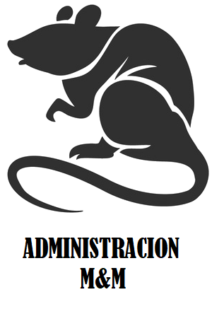

   
  Larrata GO 👮🔫🔪💣☭ 
  “2019 - Año de Casino”  

  <b>
  Reglamento y Normas de Convivencia 
   Acta N°1/19
  </b>

 

En la Ciudad Autónoma de Buenos Aires, a los 9 días del mes de enero del año 2019, en el marco del comienzo del año, Administración M&M -de ahora en adelante “La Administración”- se reúne de forma extraordinaria y publica esta versión actualizada del reglamento, agregando cambios y aclaraciones a las reglas existentes y sus correspondientes penalizaciones en caso de incumpliento, así como también nuevas reglas.

## Reglas

<ul>
  <li>
  
    <b>Artículo 1°</b>.- El agente “Gatica, Gabriel”  - DNI 39.771.115  tendrá permitido subir un máximo de 5 contenidos multimedia (fotos/videos) cada 24 horas, de los cuales 3 (tres), como máximo, podrán ser videos.  <b>Penalización:</b> 2 (dos) días por cada contenido multimedia que haya excedido el límite susodicho.
  </li>
  <li>

    <b>Artículo 2°</b>.- Está terminantemente prohibido publicar contenido que contenga o haga referencia a “Chávez, Jeremías” ya sea parcial o totalmente. 
 <b>Penalización:</b> 3 (tres) días.
  </li>
  <li>
  
    <b>Artículo 3°</b>.- Al producirse la organización de una salida, cualquier agente que se haya notificado fehacientemente del mensaje (lo haya visto, corroborado por la app de mensajería) en el cual se consulta quiénes son los interesados en concurrir a dicha reunión y no lo responda (confirmando si concurrirá o no) será expulsado del grupo. El plazo del que la persona en cuestión dispone para contestar será (en caso de que el organizador no coloque un plazo específico): desde la publicación de la propuesta hasta 90 minutos antes del comienzo de la salida. 
 <b>Penalización:</b> 4 (cuatro) días para personas normales y 7 (siete) días para personas de religión judía.
  </li>
  <li>
  
    <b>Artículo 4°</b>.- Cualquier agente que confirmase su asistencia a una salida y posteriormente no concurra a la misma, será expulsado del grupo. 
 <b>Penalización:</b> 4 (cuatro) días en caso de haber avisado de su ausencia 90 minutos antes de la salida (o anteriormente al horario determinado por el organizador), 7 (siete) días en caso de haber avisado con una antelación menor y 14 (catorce) días en caso de no haber avisado.
  </li>
  <li>
  
    <b>Artículo 5°</b>.- Los todopoderosos "Rabahia, Sergio Mathias" y "Ferrero Vilas, Matias Gabriel"  se ven exentos de cualquier regla.
  </li>
  <li>
  
    <b>Artículo 6°</b>.- Cualquier ambigüedad presentada al debatir el incumplimiento de algún artículo y/o excepción será resuelta por La Administración.
  </li>
  <li>
  
    <b>Artículo 8°</b>.- El Anexo 4° (Faltas de Ortografía) tiene total validez y vigencia. Las penalizaciones que en él se definen serán tomadas en cuenta de la misma forma que las enumeradas en estos artículos.
  </li>
</ul>

## Excepciones a las reglas

<ol>
  <li>

    El agente "Gatica, Gabriel" podrá exceder los límites establecidos en el <b>Artículo 1</b> si el contenido a publicar fuese de suma importancia para los integrantes del grupo. Se considerará contenido de suma importancia a aquella información que sea indiscutiblemente relevante para la totalidad de los integrantes del grupo y el criterio final para determinar si un contenido es de suma importancia o no será el de La Administración. En el caso de que el agente "Gatica, Gabriel" solicite que se aplique esta excepción y La Administración rechace su solicitud, la penalización será el doble de lo dispuesto por el artículo en cuestión.
  </li>
  <li>

    El <b>Artículo 3</b> no se aplica si el agente en cuestión se encuentra de vacaciones; un agente se considera  "de vacaciones" únicamente si se encuentra fuera de su propiedad por un período de al menos 2 días y además notificó en el grupo el período indicando la fecha de inicio y la fecha de finalización del mismo. La forma de notificar los períodos de vacaciones es antecediendo el símbolo numeral a la palabra “Vacaciones” (#Vacaciones) a modo de facilitar la búsqueda del mensaje en caso de ser necesario recurrir al mismo. (Ej. "#Vacaciones 01/01/19 -15/01/19").
  </li>
  <li>

    El <b>Artículo 4</b> no tiene efecto si el agente en cuestión sufre un problema familiar o de salud. Esta excepción se aplicará bajo el criterio de La Administración, que evaluará cada caso apropiadamente.
  </li>
  <li>

    Los agentes poseen inmunidad en el día de su cumpleaños.
  </li>
</ol>

## ANEXO 1º - Fechas de cumpleaños

A continuación se detallan las fechas de cumpleaños de los agentes a modo de información pública y de conocimiento popular.
<ul>
<li>7 Enero - Scapusio, Gianfranco
<li>30 Enero - Albacetti Mandrillo, Matías Nicolás
<li>26 Febrero - Rabahia, Sergio Mathias
<li>3 Marzo - Ramis, Nicolás Martín
<li>24 Abril - García Gómez, Kevin
<li>26 Abril - Addesi, Lucas Nahuel
<li>29 Abril - Simunovich, Lucas Martín
<li>1 Mayo - Vera, Santiago Raúl
<li>10 Julio - Gatica, Gabriel
<li>12 Agosto - Notario, Matias Nicolás
<li>24 Agosto - Cuomo, Daniel Hernán
<li>2 Septiembre - Corsi, Julián
<li>3 Septiembre - Ferrero Vilas, Matias Gabriel
<li>3 Octubre - Yujra Tambo, Eduardo Braian
<li>12 Octubre - Méndez, Franco Martín
<li>12 Octubre - Méndez, Gonzalo Manuel
</ul>

## ANEXO 2º - Integrantes de La Administración y colaboradores

Desígnase como Admins Supremos a los Sres. Ferrero Vilas, Matias Gabriel - DNI 39774576 y Rabahia Sergio Mathias - DNI 40136101. 
Desígnase como colaborador en la redacción tanto del presente documento como de escritos futuros al Sr. Albacetti Mandrillo, Matías Nicolás - DNI 40129244.

## ANEXO 3º - Sobrenombres de los agentes

A continuación se detallan los sobrenombres (apodos, alias) oficiales que La Administración reconoce como válidos para hacer referencia a ciertos agentes. No se incluyen en este anexo sobrenombres que consisten en apócopes obvios del nombre de un agente (ejemplos: Mati para Matías, Nico para Nicolás).

<table>
<tr>
  <th>AGENTE</th>
  <th>SOBRENOMBRE(S) RECONOCIDOS</th>
</tr>
<tr>
  <td>Ramis, Nicolás Martín</td>
  <td>“Gordo”, “Jubilado”</td>
</tr>
<tr>
  <td>Simunovich, Lucas Martín</td>
  <td>“Colo”, “Judío”</td>
</tr>
<tr>
  <td>Gatica, Gabriel</td>
  <td>“Policía”, “Gabot”, "Gabinete"</td>
</tr>
<tr>
  <td>Notario, Matías Nicolás</td>
  <td>“Noti”, “Tego”</td>
</tr>
<tr>
  <td>Cuomo, Daniel Hernán</td>
  <td>“Bisonte”</td>
</tr>
<tr>
  <td>Ferrero Vilas, Matías Gabriel</td>
  <td>“Ferrer”</td>
</tr>
<tr>
  <td>Scapusio, Gianfranco</td>
  <td>“Cachu”</td>
</tr>
</table>

#### Salvación de ambigüedades

Las referencias ambiguas hacia los agentes llamados Matías se resolverán empleando los sobrenombres oficiales de los agentes “Ferrero Vilas, Matías Gabriel” y “Notario, Matías Nicolás”.
Las referencias ambiguas hacia los agentes llamados Lucas se resolverán empleando los sobrenombres oficiales del agente “Simunovich, Lucas Martín”

## ANEXO 4° - Faltas de ortografía

Se publica el presente anexo con el fin de minimizar la cantidad de faltas de ortografía en los mensajes enviados por los agentes. 
Se llevará un conteo de las faltas graves de ortografía cometidas por los agentes y se penalizará a los agentes que hayan acumulado 4 (cuatro) faltas. 
  
#### Discriminación de faltas

No se consideran faltas graves:

<ul>
  <li>Omisión de tildes.
  <li>Omisión de mayúsculas.
  <li>Abreviaturas. Ejemplos: "q" para "que", "xq" para "porque", "lpm" para "la puta madre".
</ul>

Se consideran faltas graves:

<ul>
  <li>Utilización de letras equivocadas. Ejemplos: "concideran", "grabes".
  <li>Redacciones erróneas. Ejemplos: "va a ser falta carbón" en lugar de "va a hacer falta carbón", "ahí descuento en BK" en lugar de "hay descuento en BK"
  <li>Textos que por su carencia de signos de puntuación sean confusos o de difícil comprensión.
</ul>

La decisión final siempre estará a cargo de La Administración.

#### Conteo de faltas

Se contará con un mensaje titulado con el hashtag #FaltasDeOrtografía en el cual se contarán las faltas acumuladas por los agentes. El mismo sólo podrá ser actualizado por los miembros de La Administración o sus colaboradores designados en este documento. La sintaxis del mensaje respetará la utilizada en el siguiente ejemplo:

#FaltasDeOrtografía 
Gabi: 2/4 
Nico: 3/4 
Lucas: 1/4 

El contador se reiniciará al cambiar el año en curso.

#### Penalizaciones

Al llegar a las 4 faltas se penalizará al agente en cuestión con 1 (uno) día de expulsión. Si un agente resulta penalizado 3 veces por faltas ortográficas, al día de expulsión correspondiente se le agregarán 3 (tres) días por reiteración.

## Vigencia y firma

Este reglamento tendrá efecto una vez publicado. Es responsabilidad de cada agente la lectura del mismo y estar al tanto de cada nueva regla. Las penalizaciones no poseen lugar al reclamo. La Administración no se responsabiliza por las salidas perdidas por los agentes durante sus eventuales períodos de penalización. 
Pertenecer al Grupo Larrata GO 👮🔫🔪💣☭ implica que el agente en cuestión acepta y respetará de buena fe las reglas y consideraciones enunciadas en este documento.

<table>
  <tr>
    <td>
    <td>
  </tr>
  <tr>
    <td>Ferrero Vilas, Matías Gabriel
    <td>Rabahia, Sergio Mathias
  </tr>
</table>
